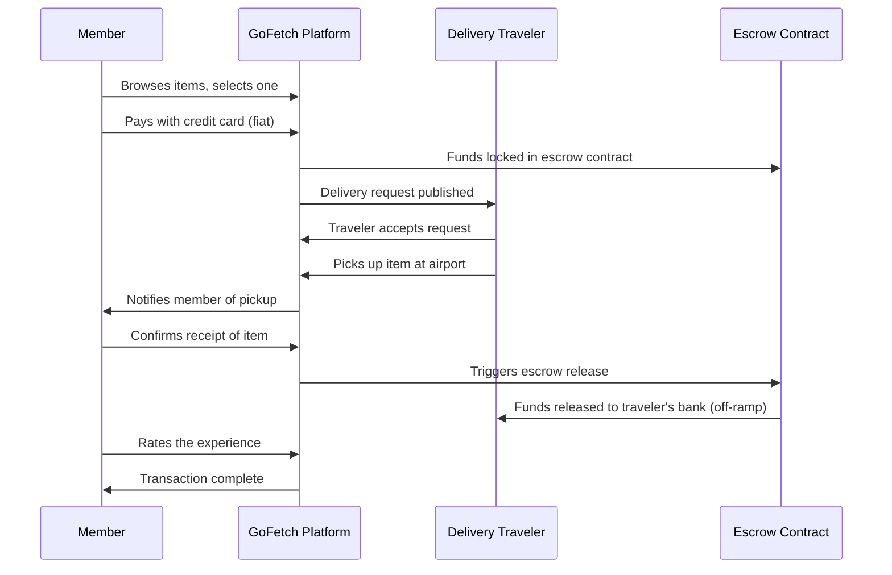
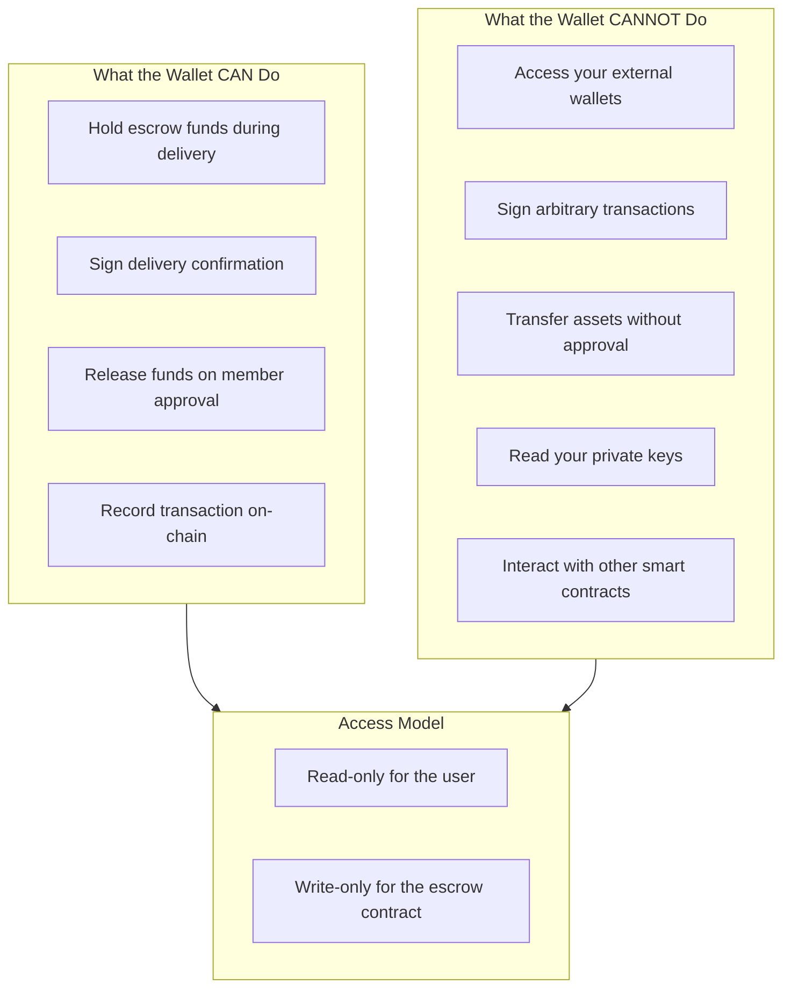
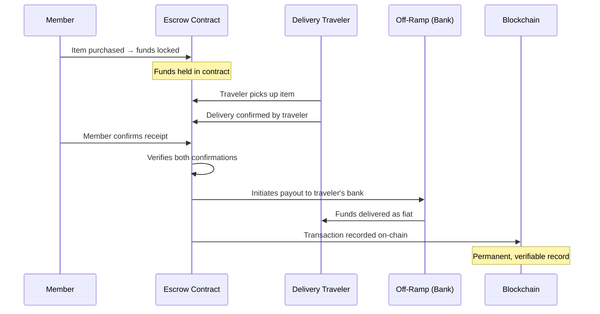

# GoFetch — Wallet Trust & Escrow Flow

## 1. The Concern

Wallet phishing and scams are a real, well-documented threat in Web3. If you've hesitated before clicking "Connect Wallet," that hesitation is rational and healthy. Bad actors exploit wallet connections to drain funds, and users have lost real money to deceptive signing requests.

GoFetch takes this seriously. Our wallet integration is designed from the ground up so that users never face this risk. The wallet exists to secure escrow funds — not to hold your personal crypto, and not to give the app access to your assets.

## 2. What GoFetch Actually Connects

GoFetch uses a **custodial/hybrid wallet model**. Here is what that means in practice:

- **No private keys to manage.** The platform generates a wallet for you automatically. You never see, store, or back up a seed phrase. There is nothing to lose.
- **No crypto required.** You pay with a credit card, just like any other online purchase. The wallet operates behind the scenes for settlement only.
- **Escrow only.** The wallet's sole purpose is to hold funds in escrow until delivery is confirmed. It cannot access external wallets or sign arbitrary transactions on your behalf.
- **Derived from your account.** Your wallet address is derived from your GoFetch account identity — you do not import an existing wallet, and you do not connect a MetaMask or Ledger.

Think of it like a temporary holding account at a bank, created automatically for each transaction. It holds funds, it releases funds, and it does nothing else.

## 3. Click & Collect Flow

Below is the end-to-end flow for a Click & Collect order:

**Key points:**
- The member never interacts with a wallet or signs a crypto transaction.
- Funds are held by the smart contract until the member confirms delivery.
- The traveler receives payment via bank transfer (fiat off-ramp), not crypto.

## 4. Why Wallet Connection is Safe

**In plain language:**
- The wallet is a **locked box** — it can hold funds and release them when the contract conditions are met.
- It **cannot** reach outside its scope. It cannot drain your MetaMask, sign a transaction on another protocol, or move funds without the member's explicit confirmation.
- The user never signs anything. The platform mediates every action.

## 5. Escrow Settlement Flow

The escrow mechanism ensures funds are protected at every stage:

**What makes this trustworthy:**
- The contract is **audited** and its logic is public on-chain.
- Funds cannot move until **both** parties confirm.
- The traveler cannot access funds early. The member cannot cancel after confirming.
- Every state change is recorded on the blockchain for full transparency.

## 6. Trust Guarantees

| Guarantee | Detail |
|-----------|--------|
| **Funds are locked in an audited smart contract** | The contract logic is reviewed, tested, and publicly verifiable on-chain. |
| **Only the member can release funds** | Escrow releases only when the member confirms delivery — not before. |
| **Traveler cannot access funds early** | The contract enforces the two-party confirmation requirement. |
| **All transactions are on-chain** | Every escrow lock, release, and settlement is recorded on the blockchain and can be independently verified. |
| **Credit card payments are PCI compliant** | Card processing is handled by Stripe — GoFetch never stores card data. |
| **No seed phrase risk** | Users never manage private keys. Wallet is account-derived and platform-managed. |

## 7. Comparison

| Feature | GoFetch | Typical DApp |
|---------|---------|--------------|
| Private key management | Platform-managed | User-managed |
| Payment method | Credit card (fiat) | Crypto only |
| Wallet access scope | Escrow only | Full wallet |
| Recovery | Account-based (email/password) | Seed phrase |
| User signs transactions | No | Yes |
| Funds at risk from phishing | None (no wallet to drain) | High |
| On-chain transparency | Yes (escrow only) | Varies |

---

**GoFetch is designed so that users never need to think about wallets, keys, or crypto.** The blockchain layer handles escrow and settlement. The user experience is: pay with a card, confirm delivery, done.
